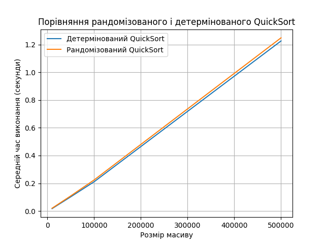

# goit-algo2-hw-10

# Завдання 1. Порівняння рандомізованого та детермінованого QuickSort

Розмір масиву: 10000
  * Рандомізований QuickSort: 0.0202 секунд
  * Детермінований QuickSort: 0.0174 секунд

Розмір масиву: 50000
  * Рандомізований QuickSort: 0.1092 секунд
  * Детермінований QuickSort: 0.1025 секунд

Розмір масиву: 100000
  * Рандомізований QuickSort: 0.2241 секунд
  * Детермінований QuickSort: 0.2111 секунд

Розмір масиву: 500000
  * Рандомізований QuickSort: 1.2488 секунд
  * Детермінований QuickSort: 1.2262 секунд

## Висновки
1. Обидва алгоритми мають приблизно однакову ефективність на масивах зі випадковими числами. Різниця в часі для кожного тесту не перевищує ~5–7%.

2. Детермінований QuickSort трохи швидший у всіх тестах.Це пояснюється тим, що вибір середнього елемента як pivot часто працює добре на випадкових масивах, забезпечуючи збалансоване розбиття.

3. Рандомізований QuickSort надійніший у гірших випадках, зокрема:

  - коли вхідний масив вже відсортований,

  - або коли всі елементи однакові.

4. Якщо опорний елемент у детермінованому варіанті буде погано ділити масив (наприклад, завжди мінімальний або максимальний), то час зросте до O(n²). Рандомізація допомагає цього уникнути.

